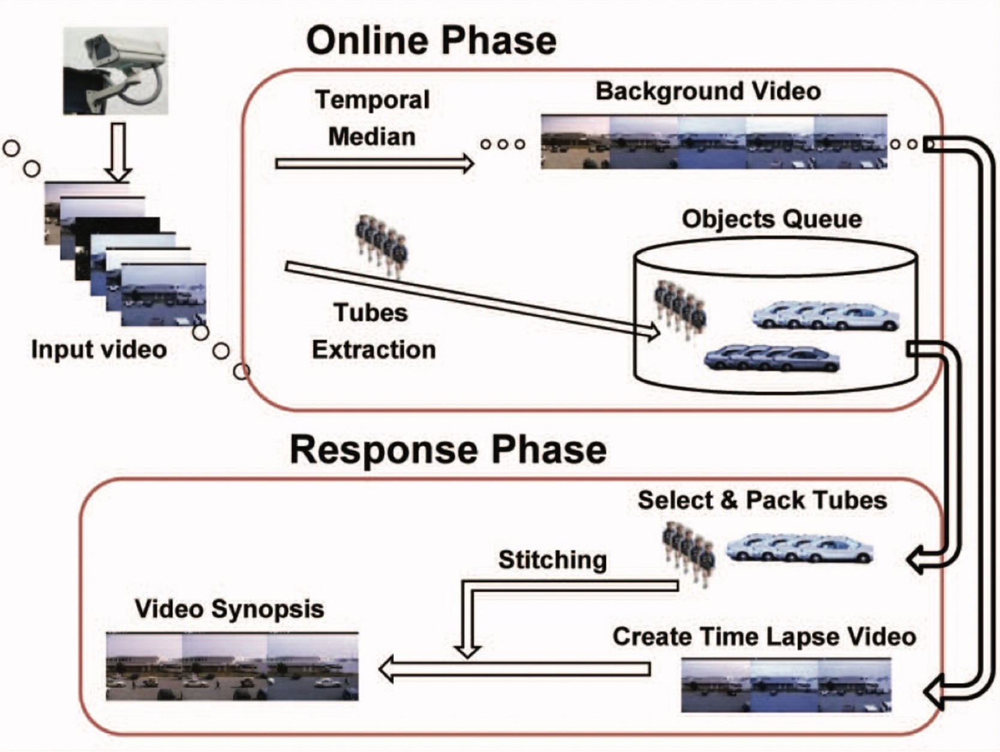
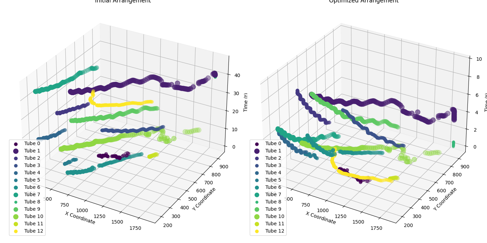

# Video Synopsis

<div style="display: flex; align-items: center; gap: 10px;">
    <a href="https://www.kaggle.com/code/mithunparab/video-synopsis" target="_blank">
        
    </a>
    <a href="https://colab.research.google.com/drive/1PxJu8XynAvpWxb_iNgpdFGYvHw5NQqnf?usp=sharing" target="_blank">
        
    </a>
</div>

---
<div style="text-align: center;">
    
    <p><em>Flow of video synopsis framework [1]</em></p>
</div>

---

## Requirements

- Python 3.8+
- Pytorch
- streamlit
- albumentations
- people-segmentation
- iglovikov-helper-functions
- filterpy
- gdown
- opencv-python
- scipy
- numpy
- Pillow

```pip install -r requirements.txt```

## Run

### WebUI

```bash
streamlit run app.py
```

### Terminal (CLI mode)

```bash
python main.py
```

- For more information regarding arguments: <br>

```bash
python main.py -h
```

```bash
Process video and perform energy optimization for video synopsis.

options:
  -h, --help                      Show this help message and exit
  -b BUFF_SIZE, --buff_size BUFF_SIZE
                                   Buffer size for capturing footage (default: 32 frames)
  -v VIDEO, --video VIDEO
                                   Path to the input video file (default: '../src/all_rush_video.mp4')
  -inmod INPUT_MODEL, --input_model INPUT_MODEL
                                   Path to the input model (default: 'Unet_2020-07-20')
  -e EXT, --ext EXT               File extension for extracted objects (default: '.png')
  -cv DVALUE, --dvalue DVALUE     Compression value (0-9; default: 9)
  -f FRAME, --frame FRAME         Frames per second (FPS) for video processing (default: 15)
  -bsz BATCH_SIZE, --batch_size BATCH_SIZE
                                   Batch size for frame-wise inference (default: 8)
  --files_csv_dir FILES_CSV_DIR   Directory to save tube CSV files (default: '*/*.csv')
  --optimized_tubes_dir OPTIMIZED_TUBES_DIR
                                   Directory for optimized tubes (default: '../optimized_tubes')
  --output OUTPUT                 Output directory for processed data (default: 'output')
  --masks MASKS                   Directory containing masks (default: '../masks')
  --synopsis_frames SYNOPSIS_FRAMES
                                   Directory for synopsis frames (default: '../synopsis_frames')
  --energy_optimization ENERGY_OPTIMIZATION
                                   Enable or disable energy optimization (default: True)
  --epochs EPOCHS                 Number of epochs for energy optimization (default: 2000)
  --bg_path BG_PATH               Path to the extracted background image (default: '../bg/background_img.png')
```

## Result

In this experiment, we utilized a sample video to demonstrate the effectiveness of our video synopsis framework. You can download the original video using the link below. The table summarizes the duration of the original video compared to the condensed synopsis generated by our framework.

[Download Video](https://drive.google.com/file/d/1ZqZ9bVY75VbuRh_A1Qfzaw0iLKpZV6X9/view?usp=sharing)

| Original Video Time (sec) | Video Synopsis Time (sec) |
|---------------------------|---------------------------|
| 49                        | 6                         |

<div style="text-align: center;">
    
    <p>Initial arrangement of tubes 49 sec and Optimized arrangment of tubes 6 sec</p>
</div>

---

## Refrences

[1]  Nonchronological Video Synopsis and Indexing Yael Pritch, Alex Rav-Acha, and Shmuel Peleg, Member, IEEE,
